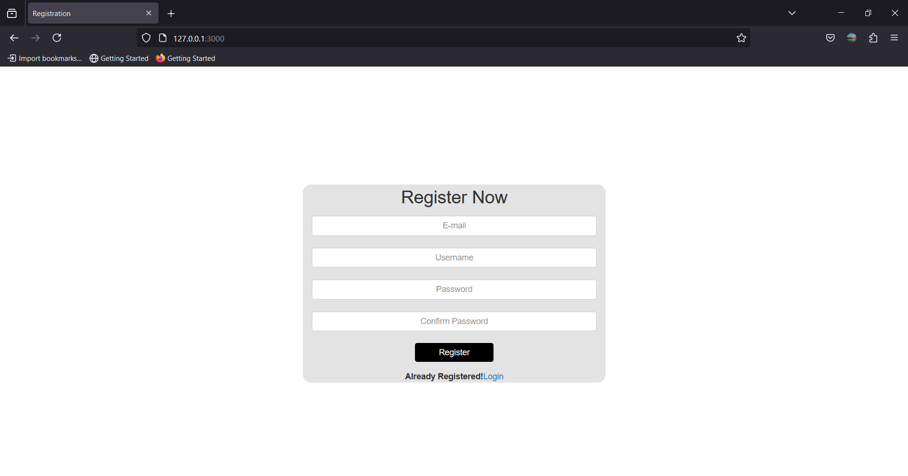
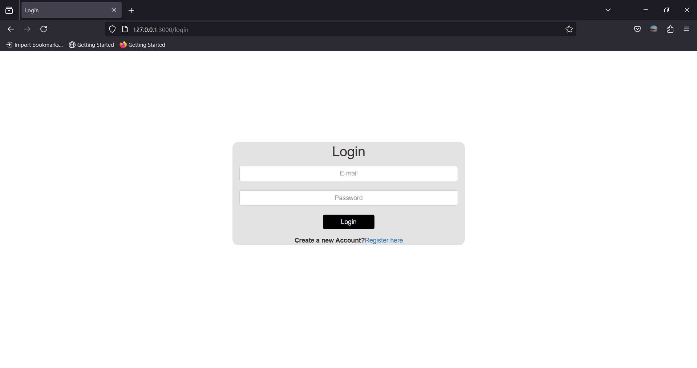

<h1 align="center">
    <b>Secure User Authentication<br> </b> 
<br>
</h1>


## Aim?
Implementing a user authentication system with secure login and registration functionality Node.js Framework using MongoDB as the data store, Express as the routing system, Body-parser as the parser for webpage, Express-session used  to track the user's session and Mongoose to make interacting with Mongo from Node easy.

## Results

### 1.Registration Form:

Allows the user to register their account by filling their Email, Username, Password.



### 2.Login Form:
If the user has been registered on the app, can login by passing the credentials.




### DataBase:
Using **[MongoDB Atlas(Cloud)](https://www.mongodb.com/cloud/atlas)** as the database. 

A Collection(**Users**) is populated with the user's credentials.

<br><br>

<br>
<br>
<br>

## Prerequisites
Tools that we need to run this app:

- ***[Node.js](https://nodejs.org/en/)***
- ***[Node Package Manager](https://www.npmjs.com/get-npm)***
- ***[MongoDB (Atlas)](https://www.mongodb.com/cloud/atlas)***

## Installing
```
npm install
```
## Connection to DataBase Access
At line 11 on ```./server.js``` change mongoose.connect('Your_MangoDB_ATLAS_CONNECTION_LINK')

## To Run the App
```
node server.js
```

The server will start Running on
+ http://localhost:3000/

