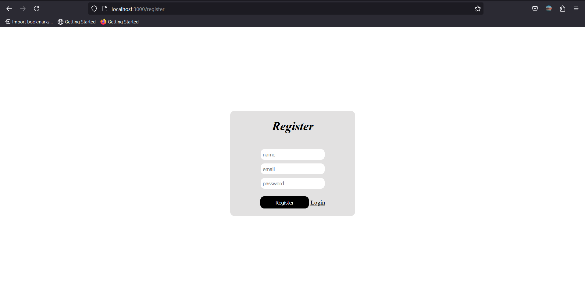
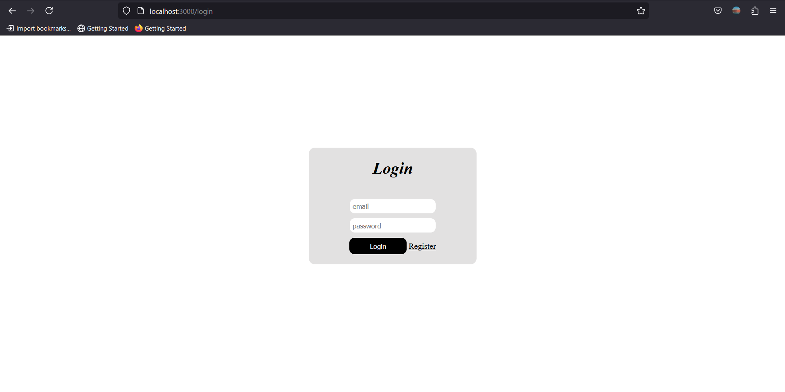
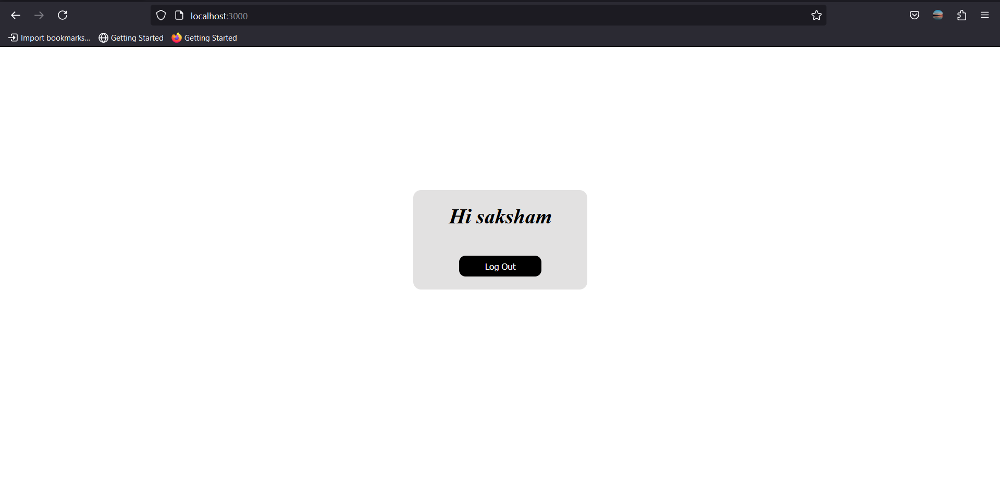
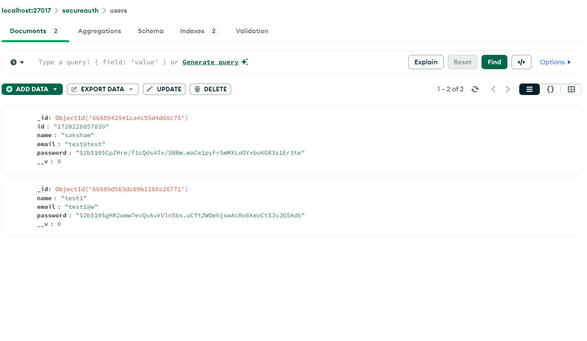

<h1 align="center">
    <b>Secure Authentication System with Node.js, Passport.js, and MongoDB<br></b> 
<br>
</h1>


## Overview

This project implements a secure authentication system using Node.js, Express.js, Passport.js for authentication strategies, bcrypt for password hashing, and MongoDB for data storage. It allows users to register, log in securely, and log out. This README provides an overview of the project, dependencies, and steps to recreate it.

## Features

- **User Registration**: Allows new users to register securely.
- **User Login**: Authenticates users with hashed passwords.
- **Session Management**: Maintains user sessions across requests.
- **Password Hashing**: Uses bcrypt for secure password storage.
- **Protected Routes**: Ensures certain routes are only accessible to authenticated users.
- **Logout**: Allows users to log out of their session.
## Results

### Registration Form:

Allows the user to register their account by filling their Email, Username, Password.



### Login Form:
If the user has been registered on the app, can login by passing the credentials.



### User's Profile:
After the user is successful logged in, a simple profile with the user's username is displayed with a session Logout button.




### DataBase:
User's Credentials are stored in the Mongodb database. 


## Dependencies

- Node.js
- Express.js
- Passport.js
- bcrypt
- MongoDB
- Mongoose
- EJS

## Getting Started

To run this project locally, follow these steps:

1. **Clone the repository**:

   ```bash
   git clone https://github.com/saksham1864/PRODIGY_FS_01
   
2. **Install dependencies**:
   ```bash
   cd PRODIGY_FS_01
   npm install

3. **Set up environment variables**:
   ```bash
   DATABASE_URL=mongodb://localhost:27017/your-database-name
   SESSION_SECRET=your_session_secret
4. **Run the application**:
   ```bash
   npm  run devStart

5. **View the application**:

   Open your web browser and navigate to http://localhost:3000 to view the application.

## Example Usage

- Register a new user with a name, email, and password.
- Log in with the registered credentials.
- Access protected routes like the homepage and log out when done.
